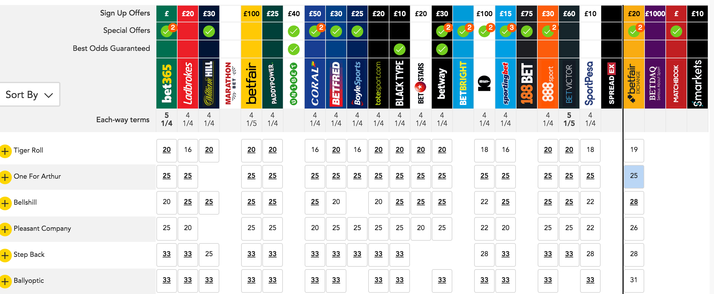
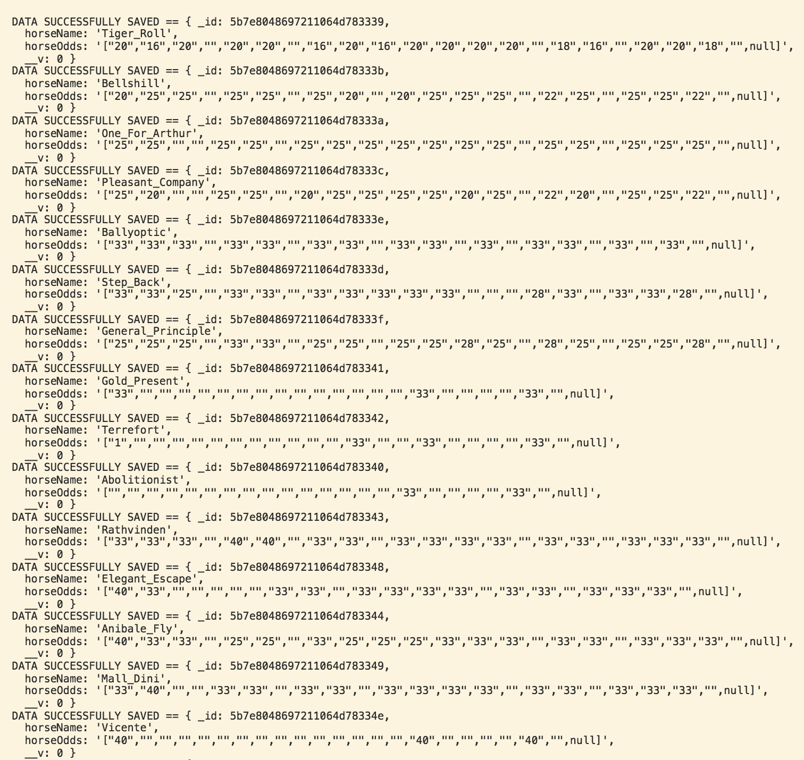
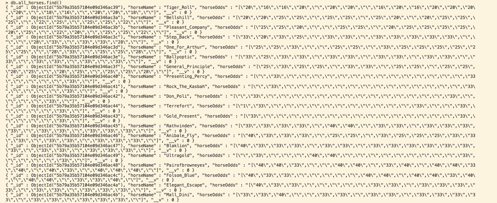

# Horse Scraper #
The application makes a GET request to Odds Checker's grand national comparison site. Then, using the CHEERIO library to convert the HTML into a searchable data structure the app retrieves all the names of the horses from the HTML.

Once this has been completed the odds that are associated with each horse are compiled. The two pieces of data - the horses and corresponding odds - are then combined into individual objects and saved to a MongoDB in JSON format.

### Result of Webpage Scraping ###

### Data Saved In Database ###

## Pre-requisites for Running The App ##
* NodeJS Installed
* MongoDB Installed
* Internet Connection to make the get request to the odds checker site

## How to Run The App ##

* Clone the github repository
* Connect to MongoDB via mongod
* Ensure there's a database called scraper_v1 and scraper_v1_created (mongoose will create the schema)
* Run the application using nodemon/node app.js

## Testing ##

Testing is completed using the jest testing framework. As the retrieval of the web data is dependent on the structure of the HTML some aspects of the app are not tested. This is because if the HTML changes then the app will need to be changed to search for the corresponding HTML tags.

That said, the following is tested  via dummy data

* Scraper identifies necessary HTML via necessary div classes/IDs
* The horse names and odds are saved to individual objects
* The function for compiling the horse names and arrays into single objects

As the div tags are passed into the objects as arguments the web scraper is reasonably flexible. It could be adapted around pages with different HTML and different data structures could also be created from the data.RThe data retrieval and organisation are separated into different objects that share data via function arguments.

## Deployment ##

The app uses Travis as  a CI tool. You can check the builds via github.

## Future Work ##
* Deploy the app online using docker
* Deploy the database online
* Complete some data analysis to show how the odds change over time and display the data via a separate webpage

